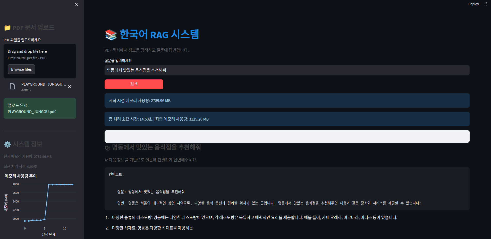

# 한국어 RAG 시스템 (Streamlit 인터페이스)

PDF 문서에서 정보를 검색하고 질문에 답변하는 한국어 기반 RAG(Retrieval-Augmented Generation) 시스템입니다. Streamlit을 사용하여 사용자 친화적인 웹 인터페이스를 제공합니다.



## 주요 기능

- 🔍 **PDF 문서 분석**: PDF 문서를 업로드하고 자동으로 벡터 데이터베이스 생성
- 💬 **자연어 질의응답**: PDF 내용에 대한 자연어 질문에 자동으로 답변 생성
- 📊 **시스템 모니터링**: 메모리 사용량 및 처리 시간 실시간 모니터링
- 📝 **참조 문서 제공**: 답변의 근거가 된 원본 문서 내용 확인 가능
- 🔄 **결과 캐싱**: 동일한 질문에 대한 빠른 응답을 위한 캐싱 메커니즘
- 📈 **시각화**: RAG 파이프라인 시각화로 시스템 작동 방식 파악 용이

## 시스템 요구사항

- Python 3.8 이상
- 최소 4GB RAM (8GB 이상 권장)
- 인터넷 연결 (모델 다운로드에 필요)

## 설치 방법

### 1. 실행 스크립트 사용

#### Linux/Mac 사용자:
```bash
chmod +x run-script.sh
./run-script.sh
```


### 2. 수동 설치 (선택 사항)

```bash
# 가상 환경 생성 (선택 사항)
python -m venv venv
source venv/bin/activate  # Linux/Mac
# 또는
venv\Scripts\activate  # Windows

# 필요한 패키지 설치
pip install -r requirements.txt

# 디렉토리 생성
mkdir -p cache vector_db temp models visualizations

# 애플리케이션 실행
streamlit run app.py
```

## 도커를 사용한 설치 (선택 사항)

```bash
# 도커 이미지 빌드
docker build -t rag-streamlit-app .

# 컨테이너 실행
docker run -p 8501:8501 rag-streamlit-app
```

## 사용 방법

1. 웹 브라우저에서 http://localhost:8501 접속
2. 사이드바에서 PDF 파일 업로드
3. 질문 입력란에 질문 작성
4. '검색' 버튼 클릭
5. 결과 확인 및 참조 문서 확인

## 시스템 구조

이 애플리케이션은 모듈화된 구조로 설계되어 있어 유지보수와 확장이 용이합니다:

```
web_llama_modular_rag/
│
├── app.py                     # 메인 애플리케이션 진입점
├── config.py                  # 시스템 설정
├── caching.py                 # 결과 캐싱 관련
├── data_loader.py             # PDF 로딩 및 벡터화
├── decision.py                # 의사결정 로직
├── embeddings.py              # 임베딩 모델 관련
├── generation.py              # 텍스트 생성 관련
├── graph_builder.py           # RAG 그래프 구축
├── llm_setup.py               # LLM 설정
├── query_processing.py        # 쿼리 처리
├── retrieval.py               # 문서 검색
├── state.py                   # 상태 관리
│
├── st_components/             # Streamlit UI 관련 컴포넌트
│   ├── ui.py                  # UI 스타일 및 표시 기능
│   ├── memory.py              # 메모리 트래킹 및 관리
│   ├── visualization.py       # 시각화 관련 기능
│   └── session.py             # 세션 상태 관리
│
├── rag_engine/                # RAG 처리 엔진 관련
│   └── processor.py           # RAG 처리 핵심 로직
```

## 사용 모델

이 시스템은 다음 모델을 사용합니다:

- **LLM**: `torchtorchkimtorch-Llama-3.2-Korean-GGACHI-1B-Instruct-v1` (한국어 Llama 모델)
- **임베딩 모델**: `ko-sroberta-multitask` (한국어 임베딩 모델)

## 성능 최적화

- CPU에 최적화된 설정으로 일반 컴퓨터에서도 원활하게 작동
- 메모리 사용량 최소화 및 모니터링
- 결과 캐싱을 통한 반복 질문 처리 속도 개선
- 효율적인 벡터 데이터베이스 생성 및 검색